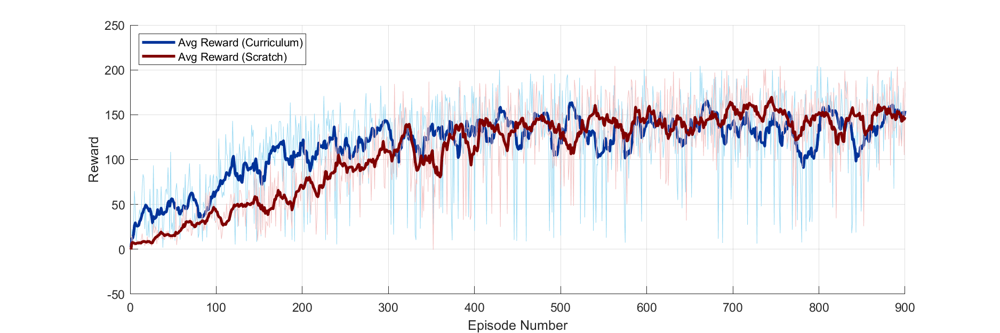

# Tracking-RL
Adaptive trajectory tracking of Omni-drive robots using Reinforcement learning 

## Requirements:
* matlab/simulink
* CoppeliaSim Edu version

## Installation
Run this command on command prompt to clone the repository:

`git clone https://github.com/love481/Tracking-RL.git`


## Usage
Use the following script to initialize the path of working directory:
```
startup.m
```

Make sure to open the CoppeliaSim simulation environment before running below code.
Use the following scripts for training and testing the RL agent on simulation environment:
```
# For Training/first phase
pretrained.m

# For Training/second phase
funetuned.m

# For inference
simulate_rl_agent.m
```

## folder Structure
* `scene` --> Simulation Environment for the robot
* `code/common` --> Contains the common utility classes or functions needed to initialize the remote connection, reading sensors, transformation and so on.
* `code/omni_drive` --> RL algorithms and other setup


#### Visualization of RL-SAC performance



## Contact Information
Please feel free to contact me if any help needed

Email: *075bei016.love@pcampus.edu.np*

